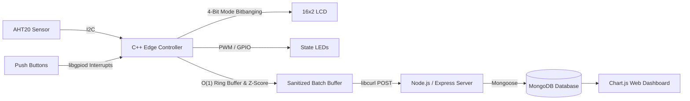

# TemperatureHumidityServer


This repository holds my Computer Science capstone project: a full-stack IoT environmental monitor and thermostat. 

Originally prototyped in Python, I ported the embedded controller entirely to C++ to get closer to the hardware and manage strict resource constraints. The system reads data from an I2C sensor, sanitizes it to catch hardware spikes, manages local state (like pulsing LEDs based on active setpoints), and batches the data over a REST API to a local Node.js/MongoDB telemetry dashboard.

---

## The Architecture

I designed this to bridge the gap between low-level, resource-constrained physical hardware and a modern web pipeline.



---

## Key Design Choices & Trade-Offs

As part of my capstone enhancements, I focused heavily on system analysis and intentional design trade-offs rather than just getting the code to "work."

### 1. Software Engineering: Python to C++ Port
While Python's abstracted libraries are great for rapid prototyping, I wanted the granular control necessary for compiled, hardware-level performance. I utilized `libgpiod` to manage GPIO button interrupts and engineered manual "bitbanging" for the 16x2 LCD in 4-bit mode. By choosing this manual approach over a heavy background daemon like `LCDProc`, I prioritized system efficiency over development speed. (This also taught me the critical importance of relying on official repository documentation, after wasting time on deprecated `libgpiod` v1 tutorials!)

### 2. Data Structures: Constant-Time Ring Buffer & Anomaly Detection
To validate outgoing sensor data, I implemented a ring buffer coupled with a Z-score sanitization algorithm to filter out hardware voltage spikes. I deliberately engineered the buffer's capacity to be a power of 2. This allowed me to use bitwise masking rather than costly modulo operations to perform the wrapping, ensuring constant-time insertions on the microcontroller. 

### 3. Databases: Full-Stack Telemetry Pipeline
Rather than leaving the data trapped on the embedded device, I established a pipeline using `libcurl` to manually batch, format, and send sensor readings via HTTP POST requests. A Node.js and Express server ingests this JSON data, stores it securely in a MongoDB database, and serves it to a Chart.js dashboard. 

---

## Repository Structure

```text
TemperatureHumidityServer/
├── C++Port/                           # C++ Embedded Controller
│   ├── main.cpp                       # Core execution loop 
│   └── headers/                       # Header-first hardware abstraction
│       ├── buffer.h                   # Power-of-2 ring buffer & Z-score filtering
│       ├── Sensor.h                   # AHT20 I2C communication driver
│       ├── GPIOInterface.h            # libgpiod pin configurations
│       ├── Display.h                  # 4-bit mode LCD bitbanging
│       ├── StateMachine.h             # Thermostat mode & setpoint logic
│       ├── POSTer.h                   # libcurl HTTP payload generation
│       └── Serial.h                   # Serial debugging utility
├── TemperatureHumidityConsole/        # Node.js / Express Backend
│   ├── server.js                      # Express API & MongoDB schemas
│   ├── public/                        # Web dashboard assets (Chart.js)
│   └── received_readings/             # Local JSON backup storage
└── README.md
```

---

## Hardware Requirements

If you want to replicate the physical system, you will need:
* Raspberry Pi (GPIO header enabled)
* AHT20 Temperature & Humidity Sensor (I2C)
* 16x2 Character LCD Display (HD44780 compatible)
* Red & Blue LEDs
* 3x Momentary Push Buttons
* USB-TTL Serial Cable (optional, for serial logging)

---

## Prerequisites & Setup

You will need a C++17 compiler and a few specific libraries on your Raspberry Pi:

```bash
sudo apt update
sudo apt install -y build-essential git curl nodejs npm mongodb-server mongodb-clients libgpiod-dev libcurl4-openssl-dev
```

### 1. Start the Backend Telemetry Service
Ensure MongoDB is running locally, then initialize the Express server:

```bash
cd TemperatureHumidityConsole
npm install
sudo systemctl start mongodb
npm start
```
*The web dashboard will now be listening on `http://localhost:3000`.*

### 2. Compile & Run the C++ Controller
From the project root, compile the C++ application, linking the GPIO and URL libraries:

```bash
cd C++Port
g++ -std=c++17 -Wall -Wextra -pthread main.cpp -o thermostat -lgpiod -lcurl
./thermostat
```

---

## Data Format

Every 16 readings, the edge device batches the sanitized data and posts it to the backend (`POST /data/readings`) in the following structure:

```json
{
  "readings": [
    {
      "Index": 0,
      "Temperature": 734,
      "Humidity": 456,
      "Timestamp": 1720000000
    }
  ]
}
```
*(Note: The raw integer representations for temperature and humidity are converted to standard floating-point units for the physical LCD within the C++ logic).*