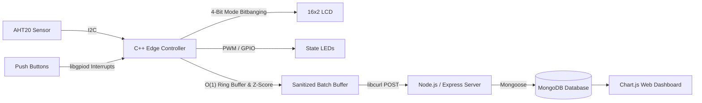

# TemperatureHumidityServer


This repository contains my final project for the SNHU CS Program, an IoT device that gathers temperature and humidity data and reports it to an outside webserver. This project was ported from a preexisting Python project, with the goal to increase performance and decrease resource usage. The software relies on an I2C sensor, which provides input utilized throughout most of the system. These inputs were used both for the basic state machine, as well as components like LEDs, an LCD, and 3 buttons requiring interrupt detection, all of which were implemented with heavy reliance on the libgpiod library for C++. The project was enhanced throughout the course through the addition of a data structure that allowed for the implementation of a sanitization algorithm and the use of libcurl which allowed for POSTing data batched from this structure.
---

## The Architecture

I designed this to bridge the gap between low-level, resource-constrained physical hardware and a modern web pipeline.



---

## Key Design Choices & Trade-Offs

As part of my capstone enhancements, I focused heavily on system analysis and intentional design trade-offs rather than just getting the code to "work."

### 1. Software Engineering: Python to C++ Port
While Python's focus on readability and its ecosystem of libraries help to build prototypes, its often not the best for a final product. With the understanding that more resources means more money, I wanted to decrease the overhead for this "final product". This move meant that I would have to find libraries to replace the functionality of those found in Python, libgpiod being the absolute most important for this project. I initially hesitated when deciding on how to control the LCD, I would likely be able to get something like LCDProc to run in the background while the main program ran. This would prevent having to manage the LCDs loop within the code, but also require an entirely separate program running alongside my own. This led me to bitbanging, which relied on libgpiod as well.
### 2. Data Structures: Constant-Time Ring Buffer & Anomaly Detection
The main data structure within the program is the ring buffer, which was implemented to help validate sensor data before leaving the system. This data used a Z-score system to filter out "impossible" readings. The buffer itself was kept to a power of 2, initially 8, but raised to 16 because the smaller capacity gave a new reading too much influence on the mean. This power of 2 design allowed for bitwise masking, which prevented the use of modulo operations while wrapping through the buffer. This allowed for constant time operations. 
### 3. Databases: Full-Stack Telemetry Pipeline
While the data was being placed into a structure, it was being overwritten every time the buffer began to wrap. To establish data persistence, I utilized libcurl to POST the data, in batches of 16, out to a different machine. This machine ran a Node.js and Express server, which would serve this data out to a MongoDB. This data was then made visual in chart form by utilizing a Chart.js dashboard. 
---

## Repository Structure

```text
TemperatureHumidityServer/
├── C++Port/                           # C++ Embedded Controller
│   ├── main.cpp                       # Core execution loop 
│   └── headers/                       # Header-first hardware abstraction
│       ├── buffer.h                   # Power-of-2 ring buffer & Z-score filtering
│       ├── Sensor.h                   # AHT20 I2C communication driver
│       ├── GPIOInterface.h            # libgpiod pin configurations
│       ├── Display.h                  # 4-bit mode LCD bitbanging
│       ├── StateMachine.h             # Thermostat mode & setpoint logic
│       ├── POSTer.h                   # libcurl HTTP payload generation
│       └── Serial.h                   # Serial debugging utility
├── TemperatureHumidityConsole/        # Node.js / Express Backend
│   ├── server.js                      # Express API & MongoDB schemas
│   ├── public/                        # Web dashboard assets (Chart.js)
│   └── received_readings/             # Local JSON backup storage
└── README.md
```

---

## Hardware Requirements

If you want to replicate the physical system, you will need:
* Raspberry Pi (GPIO header enabled)
* AHT20 Temperature & Humidity Sensor (I2C)
* 16x2 Character LCD Display (HD44780 compatible)
* Red & Blue LEDs
* 3x Momentary Push Buttons
* USB-TTL Serial Cable (optional, for serial logging)

---

## Prerequisites & Setup

You will need a C++17 compiler and a few specific libraries on your Raspberry Pi:

```bash
sudo apt update
sudo apt install -y build-essential git curl nodejs npm mongodb-server mongodb-clients libgpiod-dev libcurl4-openssl-dev
```

### 1. Start the Backend Telemetry Service
Ensure MongoDB is running locally, then initialize the Express server:

```bash
cd TemperatureHumidityConsole
npm install
sudo systemctl start mongodb
npm start
```
*The web dashboard will now be listening on `http://localhost:3000`.*

### 2. Compile & Run the C++ Controller
From the project root, compile the C++ application, linking the GPIO and URL libraries:

```bash
cd C++Port
g++ -std=c++17 -Wall -Wextra -pthread main.cpp -o thermostat -lgpiod -lcurl
./thermostat
```

---

## Data Format

Every 16 readings, the edge device batches the sanitized data and posts it to the backend (`POST /data/readings`) in the following structure:

```json
{
  "readings": [
    {
      "Index": 0,
      "Temperature": 734,
      "Humidity": 456,
      "Timestamp": 1720000000
    }
  ]
}
```
*(Note: The raw integer representations for temperature and humidity are converted to standard floating-point units for the physical LCD within the C++ logic).*
